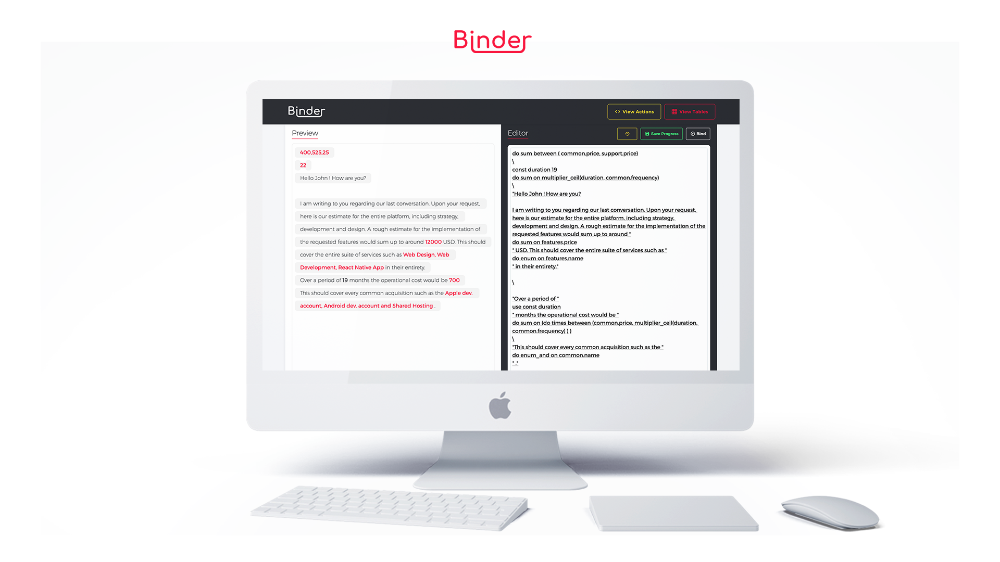

# fii-plp-binder

# Project for FII-PLP (II.1.) Course 2018 

#### Developer:
- Razvan Gabriel Apostu

#### Description:
Custom query language for optimizing inline computation of data, created as a final project for the FII-PLP (Principles of Programming Lanugages) Course II.1. 2018.
Live preview on https://nervous-lewin-bb77cd.netlify.com/
Project brief at [Binder Project Brief](ProjectBrief.pdf).
